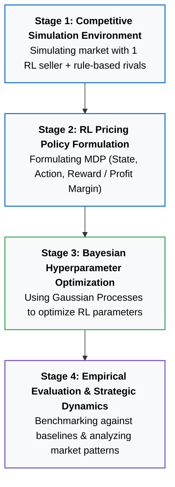

# Dynamic Pricing Under Competition Using Reinforcement Learning and Bayesian Hyperparameter Optimization

> **Bachelor's Graduation Research Project**  
> **Student:** Reza Eskandari  
> **Supervisor:** Dr. Abbas Ahmadi  
> **Affiliation:** Department of Industrial Engineering and Management Systems  

---

##  Project Status: Work in Progress 
This repository hosts the official development and documentation of my B.Sc. thesis. The project proposal has been formally approved, and the algorithmic implementation and empirical simulations are **currently under active development**.

---

##  Official Proposal Document
The complete academic proposal outlining the theoretical background, research gap, and methodology is available in both PDF and LaTeX formats:

-  **[Download Thesis Proposal (PDF)](docs/Proposal_English.pdf)**
-  **[View LaTeX Source Code](docs/Proposal_English.tex)**

---

##  Executive Summary & Motivation
In digital retail platforms, real-time price comparison drives intense competition. Traditional pricing models (static optimization, fixed heuristics) fail to handle rapid market volatility and strategic opponent behaviors.

While **Reinforcement Learning (RL)** enables agents to learn adaptive pricing policies through trial-and-error, existing studies predominantly focus on single-agent (monopolistic) setups. When RL is deployed in **competitive, multi-seller settings**, the market becomes **non-stationary**:
- Competitor reactions directly alter the learning agent's reward landscape.
- Learning algorithms become acutely sensitive to hyperparameters (e.g., learning rates, discount factors, exploration schedules).
- Poor configurations can trigger catastrophic algorithmic divergence, price wars, or unintended tacit collusion.

**Research Objective:**  
This thesis bridges this gap by proposing an integrated framework combining **Reinforcement Learning** with **Bayesian Optimization (BO)** in a simulated competitive market. I leverage BO to systematically and intelligently tune RL hyperparameters, ensuring learning stability, faster convergence, and robust revenue performance under competitive pressure.

---

##  Key Literature
1. **Kastius, A., & Schlosser, R. (2022).** *Dynamic pricing under competition using reinforcement learning.* Journal of Revenue and Pricing Management.
2. **Rana, R., & Oliveira, F. S. (2014).** *Dynamic retail pricing via Q-learning.*
3. Literature on *Leveraging Reinforcement Learning and Bayesian Optimization for Automated Hyperparameter Scheduling*.
